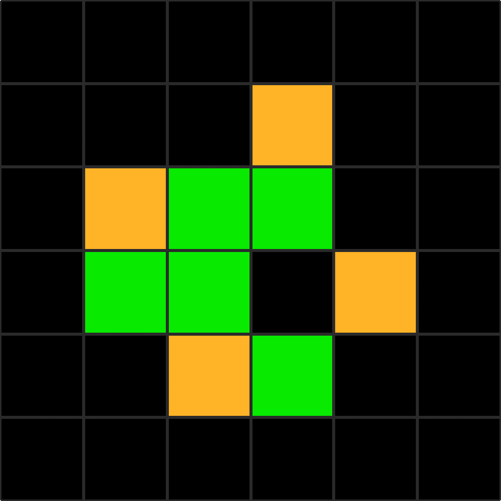
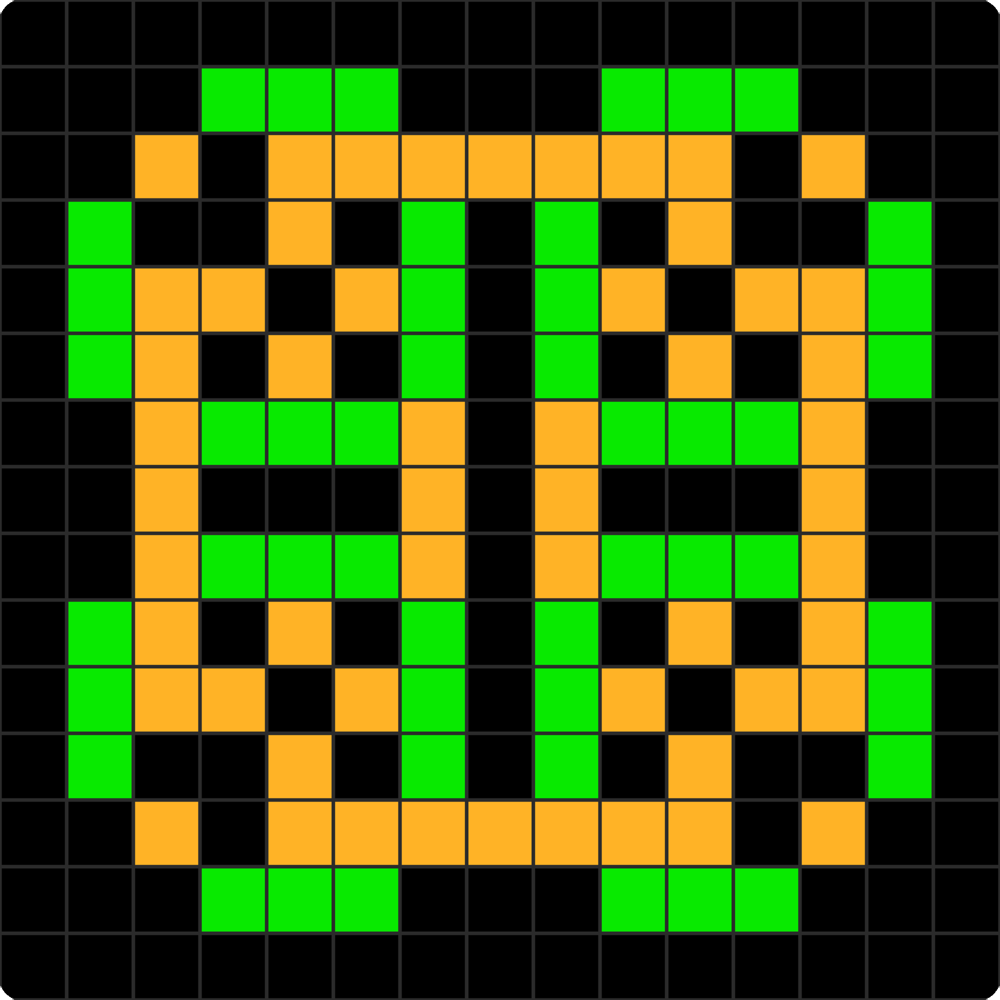

# 🌱 Multi-State Cellular Automaton

This project is a **C# console implementation** of a custom cellular automaton, inspired by Conway’s Game of Life, but extended with **multiple states** and custom structures.

## ✨ Features
- Runs directly in the console
- Supports **3 different states**:
  - `0` → Dead  
  - `1` → Semi-alive  
  - `2` → Alive  
- Includes **interactive structure placement** (choose coordinates + orientation)
- Optimized console rendering (fast refresh with `Console.SetCursorPosition`)

---

## 🧬 Rules

The automaton evolves step by step according to neighbor counts.

- **Alive cells (2):**
  - Die if overpopulated (>5 neighbors)
  - Stay alive if supported (2–3 neighbors)
  - Otherwise decay into semi-alive

- **Semi-alive cells (1):**
  - Become fully alive if they have 3 alive neighbors
  - Stay Semi-alive if suported by more than 3 Semi-alive neighbors
  - Otherwise decay back to dead

- **Dead cells (0):**
  - Revive as semi-alive if they have exactly 3 alive neighbors

---

## 🏗️ Naturally generated Structures

**Glider**
-> 8 frames

**3 steps Oscillator**
-> 3 frames

You can find thoses structures in `Structures.cs` and place them on the grid.
You can add your own by defining a 2D array in `Structures.cs`.
